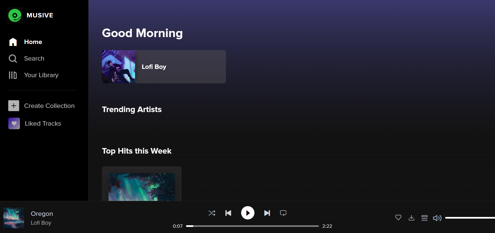

<!-- markdownlint-disable -->

  

 
<h1 align="center">AWS Educate CloudFront Music Workshop</h1>

  
  
  

<!-- markdownlint-restore -->

## Overview

Welcome to the **AWS Educate CloudFront Music Workshop**! This hands-on workshop is designed to help you explore AWS services and learn how to build and optimize a music streaming application. To cater to different levels of expertise, we offer two versions of the workshop:

1. [🔹 Level 300: Advanced Workshop](#-level-300-advanced-workshop)
2. [🔹 Level 200: Beginner-Friendly Workshop](#-level-200-beginner-friendly-workshop)

We hope this workshop helps you enhance your skills and gives you practical experience with AWS services. 🚀

## 🔹 Level 300: Advanced Workshop

Designed for participants with prior experience in AWS, SQL, and Python. This version dives deep into advanced AWS services and involves more complex operations, including managing databases and deploying Lambda@Edge functions.

### Prerequisites

- Familiarity with SQL
- Basic understanding of Python
- Advanced understanding of AWS services

### Key AWS Services

- **AWS CloudFormation**
- **AWS EC2**
- **AWS RDS** (requires SQL queries)
- **AWS CloudFront**
- **AWS S3**
- **AWS Lambda** (Lambda@Edge)

### Getting Started

> [!NOTE]
> Esimated Time: 3 hours

🔗 [Workshop Material - Level 300](https://bit.ly/20240705cf)

## 🔹 Level 200: Beginner-Friendly Workshop

This beginner-friendly version is designed for participants who are new to AWS or prefer a simpler, more streamlined approach. We've taken care of some of the more complex aspects for you, allowing participants to **focus on the core components of CloudFront**. Please note that Lambda@Edge is not covered in this version.

<!-- markdownlint-disable -->
### Prerequisites

- Basic understanding of AWS services

### Key AWS Services

- **AWS CloudFormation**
- **AWS S3**
- **AWS CloudFront**

### Getting Started

> [!NOTE]
> Esimated Time: 1,5 hours

🔗 [Workshop Material - Level 200](https://bit.ly/20241019ws)
<!-- markdownlint-restore -->

---

## Contact

If you encounter any issues, feel free to reach out at <support@aws-educate.tw> or [submit an issue](https://github.com/aws-educate-tw/aws-cloudfront-music-workshop/issues/new).

## Credits

This workshop is inspired by the amazing work done in the **[Musive Backend 2.0](https://github.com/Ansh-Rathod/Musive-backend-2.0)** project.

## License

This project is licensed under the MIT License. See the [LICENSE](LICENSE) file for details.

Copyright © 2025 AWS Educate Cloud Ambassador Taiwan
